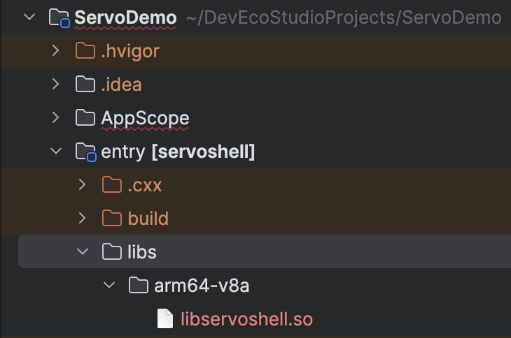

# OpenHarmony Servo Demo application

A simple demo browser application for running [servo] on OpenHarmony.

## ServoDemo ArkTS app

Similar to android and iOS, OpenHarmony apps also require some amount of glue code in the platform language - ArkTS.
This repository contains exactly this glue code. In the future the repo will likely be integrated into the upstream
servo repo.

## Usage

If you are on Windows or MacOS, you can simply open this repository in the [DevEco Studo] IDE, which will automatically
take care of generating signing keys etc. If you are on a Linux machine please checkout the section on
[Compiling and Signing the ServoDemo app for HarmonyOS on Linux machines](#compiling-and-signing-the-servodemo-app-for-harmonyos-on-linux-machines).

### Quick start

This quick-starts assumes you are a developer and familiar with DevEco Studio.
1. Download this repository and open it in DevEco Studio.
2. Download the prebuilt shared library `servo-aarch64-linux-ohos.so` from [servo nightly builds](https://github.com/servo/servo-nightly-builds/releases).
3. Rename the file to `libservoshell.so` and place it in the folder `entry/libs/arm64-v8a`. Create the folder if it doesn't exist.
4. Create a signing configuration. 
5. Use DevEco Studio to deploy the app to your phone / tablet or other device..



### Preferences

Servo can be configured by editing `AppScope/resources/resfile/servo/prefs.json`.
This allows you to conveniently edit the default preferences and e.g. enable or disable different features.
See the `Preferences` struct in [servo's config/prefs.rs](https://github.com/servo/servo/blob/main/components/config/prefs.rs)
for a list of available options.
Please note that an invalid `prefs.json` configuration will result in a crash during startup.

```json
{
  "user_agent": "Custom User-agent"
}
```

### Contributing

If you want to improve the ArkTS / ArkUI page for this Demo browser app, you are free to open pull-requests in this
repository. However, more complicated changes may require also changing the servo Rust code. See the section below
on how to contribute to Servo itself.


### Building `libservoshell.so`

Checkout the [main servo repository](https://github.com/servo/servo) and read the [servo book](https://book.servo.org/title-page.html),
specifically the sections on [building servo](https://book.servo.org/hacking/building-servo.html) and 
[building servo for OpenHarmony](https://book.servo.org/hacking/building-for-openharmony.html)

Once you have completed the setup you can build servo for HarmonyOS by running
```shell
./mach build --ohos --flavor=harmonyos [--release]
```

After building `libservoshell.so`, you can copy it into the `entry/libs/arm64-v8a` directory, e.g.
```shell
# Take care to replace <build-profile> with debug, release or which other profile you were building for.
cp /path/to/servo/target/aarch64-unknown-linux-ohos/<build-profile>/libservoshell.so /path/to/ServoDemo/entry/libs/arm64-v8a/libservoshell.so
```


## Building the .hap app with DevEco Studio (Windows and Mac only)

After you have copied the `libservoshell.so` to the correct location, you can simply connect your device to your computer, or start the
HarmonyOS emulator and click the "Run" button on the top to build and flash the .hap app.
That should automatically package and flash the app to your phone.
Please note that you need to login first with your Huawei Developer ID, to generate signing keys. You can login by clicking on the 
profile button in the top right corner.

## Compiling and Signing the ServoDemo app for HarmonyOS on Linux machines

DevEco Studio is not available for Linux machines yet, but you can still compile and sign from the command-line after some initial setup.
Note, that as far as I know you will still need access to a windows or mac macine with DevEco Studio at least once to generate
the signing keys needed when flashing apps to a Harmony OS device.

### Setup and dependencies 

Download the [Command Line Tools for HarmonyOS NEXT]. Note that this requires
logging in with a registered and verified Huawei Developer account.

Extract the command line tools to a directory of your choice, and setup the following environment-variables
```
export DEVECO_SDK_HOME=/path/to/command-line-tools/sdk
export NODE_HOME=/path/to/command-line-tools/tool/node
```

For your convenience I would also recommend to add the necessary tools to your PATH:

```
# hvigorw is the build tool wrapper
export PATH=/path/to/command-line-tools/hvigor/bin:$PATH
# Add `hdc` to path (like adb for android)
export PATH=/path/to/command-line-tools/sdk/HarmonyOS-NEXT-DB1/openharmony/toolchains/:$PATH
```

Generate signing keys with DevEco Studio (on a windows or mac machine) and copy the keys from `$HOME/.ohos/config`
to the same location on your Linux machine. 
Copy the `signingConfigs` field in the `build-profile.json5` to your Linux machine, but take care to not commit the 
configuration to git, since it contains sensitive information such as the Password for the signing key.
Adjust the absolute paths in the `signingConfigs` to your target machine.

After that running `hvigorw assembleHap` should succeed.

### Building, signing and flashing the ServoDemo app on Linux

Once you have the [Command Line Tools for HarmonyOS NEXT] installed, you can just manually run the commands that DevEco Studio 
executes under the hood. 

1. Build the app

```
# Build the .hap file with default settings.
hvigorw assembleHap
# Stop and uninstall any older versions of the servodemo.
hdc shell aa force-stop com.servo.demo
hdc uninstall com.servo.demo
# Create a temporary directory on the device and send the .hap file to the device
hdc shell mkdir data/local/tmp/servoshell-tmp
hdc file send entry/build/default/outputs/default/servoshell-default-signed.hap "/data/local/tmp/servoshell-tmp"
# Install the app
hdc shell bm install -p data/local/tmp/servoshell-tmp
# Clean-up the temporary folder
hdc shell rm -rf data/local/tmp/servoshell-tmp
# Optionally start the app from the command-line
# Note: You can also start the app on the phone by touching the servo app icon.
hdc shell aa start -a EntryAbility -b com.servo.demo
```

[servo]: https://github.com/servo/servo
[OpenHarmony]: https://gitee.com/openharmony/docs/blob/master/en/OpenHarmony-Overview.md
[DevEco Studo]: https://developer.huawei.com/consumer/cn/deveco-studio
[Command Line Tools for HarmonyOS NEXT]://developer.huawei.com/consumer/cn/download/
